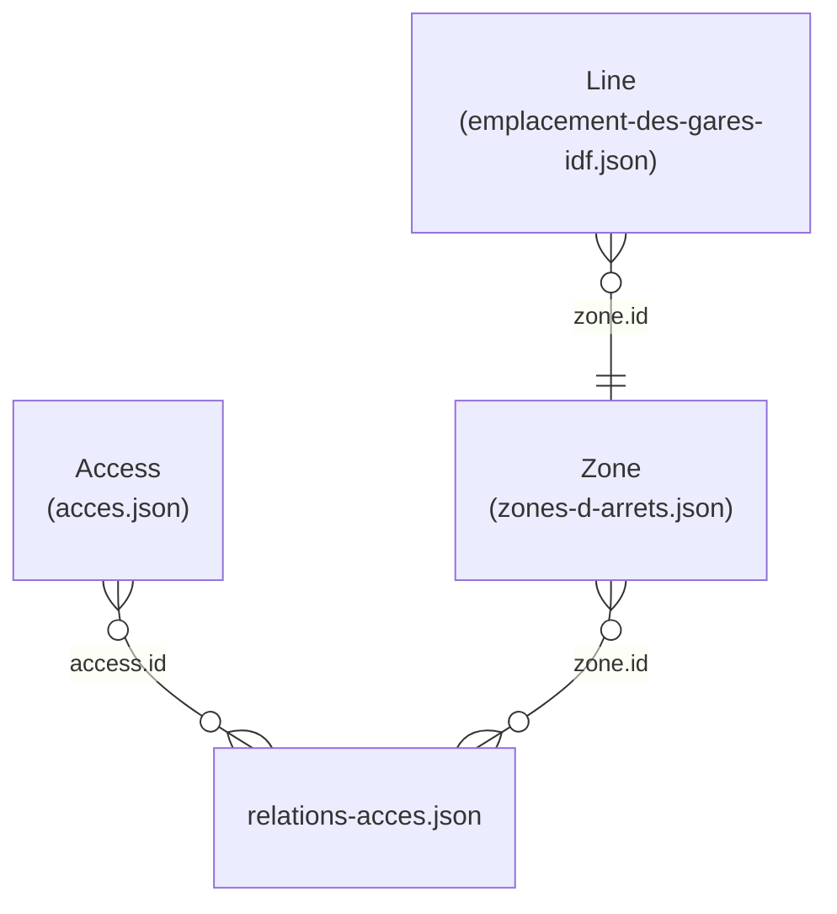

# Metro Photos

This project aims to gather pictures of all metro entrances in Paris and link them to their entrance, station, and lines.

## App

The app will be a website allowing people to:

- View photos associated to each metro entrance and station
- Upload pictures of the metro and - as automatically as possible - link that photo to the right metro entrance

The uploaded pictures will be put on an cloud object storage, e.g. OVH's Object Storage.
The upload mechanism will also take care of bluring people's faces in the background, which means we will have a proper backend and long running background tasks.

## Data

The data used in this repo originates from IDFM's efforts to open their internal data: https://data.iledefrance-mobilites.fr

You will find the source data in `./data/source`, and the result of my clean up/filter in `./data/generated`.

The final model we use is [zones_metro.json](./data/generated/zones_metro.json) which lists all metro stations, their entrances, and their lines.

### Model

### Source Files

- [acces.json](./data/source/acces.json): [IDFM Link](https://data.iledefrance-mobilites.fr/explore/dataset/acces)
- [emplacement-des-gares-idf.json](./data/source/emplacement-des-gares-idf.json): [IDFM Link](https://data.iledefrance-mobilites.fr/explore/dataset/emplacement-des-gares-idf)
- [relations-acces.json](./data/source/relations-acces.json): [IDFM Link](https://data.iledefrance-mobilites.fr/explore/dataset/relations-acces)
- [zones-d-arrets.json](./data/source/zones-d-arrets.json): [IDFM Link](https://data.iledefrance-mobilites.fr/explore/dataset/zones-d-arrets)
